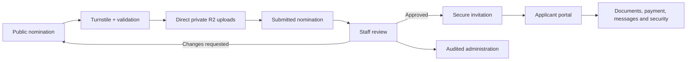

<p align="center">
  <a href="https://access.gbeaward.com">
    
  </a>
</p>

<p align="center">
  <strong>Secure nominations, applicant access and award operations for the Global Business Excellence Awards 2026.</strong>
</p>

<p align="center">
  <a href="https://access.gbeaward.com">🌐 Live portal</a>
  &nbsp;·&nbsp;
  <a href="https://access.gbeaward.com/apply">🏆 Submit a nomination</a>
  &nbsp;·&nbsp;
  <a href="https://access.gbeaward.com/help">💬 Get help</a>
</p>

<p align="center">
  
</p>

# GBE Awards Portal

The production portal for the **Global Business Excellence Awards 2026**. It gives nominees a clear, secure path from public nomination through payment proof and document upload; gives approved applicants a private self-service portal; and gives staff one focused workspace for review, communications, payments, reporting and audit history.

**Live:** [access.gbeaward.com](https://access.gbeaward.com)

**Support:** [info@gbeaward.com](mailto:info@gbeaward.com) · [WhatsApp](https://wa.link/10p065)

**Official site:** [gbeaward.com](https://gbeaward.com)

> [!IMPORTANT]
> This is a production system for personal, nomination and payment information. Never commit `.env`, provider credentials, database exports, real nomination data or screenshots containing private information.

## ✨ What it does

| For                     | Experience                                                                                                                                                                                                                                                         |
| ----------------------- | ------------------------------------------------------------------------------------------------------------------------------------------------------------------------------------------------------------------------------------------------------------------ |
| **Nominees**            | A four-step public nomination journey with category selection, supporting documents, payment choice and payment-proof upload. Every file is uploaded directly to private storage and every completed nomination gets a non-sequential `GBE-2026-######` reference. |
| **Approved applicants** | Invitation-only access to applications, requested documents, payment status, messages, profile, password management and account security. A public nomination never creates an account by itself.                                                                  |
| **Award staff**         | One focused Staff workspace for applications, applicants, payments, files, communications and exports. Payment verification uses a focused review dialog for required reconciliation details; payer and bank-reference context remain optional. Super admins also manage award cycles, categories, staff, settings and audit activity. Staff must enrol TOTP MFA before administration access. |
| **Operations**          | Controlled workflow transitions, reviewer assignment, change requests, payment verification, signed downloads, exports, delivery tracking, retention work and an auditable history of sensitive actions. Server-action buttons lock and show progress while processing, and internal navigation provides delayed feedback without flashing on fast routes. |

## 🧭 Product flow


```mermaid
flowchart LR
  N[Public nomination] --> T[Turnstile + validation]
  T --> U[Direct private R2 uploads]
  U --> Q[Submitted nomination]
  Q --> R[Staff review]
  R -->|Approved| I[Secure invitation]
  R -->|Changes requested| N
  I --> P[Applicant portal]
  P --> O[Documents, payment, messages and security]
  R --> A[Audited administration]
```

The public form is deliberately short and guided:

1. **Nominee** — company name or full name.
2. **Contact** — contact details, award category, mandatory nomination statement and optional supporting documents.
3. **Payment**: secure Genie card checkout (when enabled), or bank transfer with one payment-proof file. Card payments never require a slip.
4. **Confirm** — declaration review, Turnstile verification and submission.

Supporting documents and payment proof are independently limited to **5 MB per file**. The browser gives upload progress, cancellation and retry feedback; the server repeats validation before accepting a completion request.

## 🏗️ Architecture

| Layer            | Technology                                             | Responsibility                                                                                            |
| ---------------- | ------------------------------------------------------ | --------------------------------------------------------------------------------------------------------- |
| Application      | Next.js 16 App Router, React 19, strict TypeScript     | Public, applicant and staff routes; server actions; route handlers; streaming loading states.             |
| Interface        | Tailwind CSS 4, shadcn/Base UI, TanStack Table         | Responsive, keyboard-accessible light-mode interface with tailored mobile/tablet layouts.                 |
| Data             | Neon PostgreSQL, Drizzle ORM                           | Relational award data, workflow state, accounts, audit history, email outbox, rate limits and migrations. |
| Authentication   | Better Auth + Drizzle adapter                          | Approval-first invitations, password recovery, session revocation and mandatory TOTP MFA for staff.       |
| File storage     | Cloudflare R2 + AWS SDK                                | Private, browser-to-R2 presigned uploads; type detection; signed downloads; lifecycle cleanup.            |
| Abuse protection | Cloudflare Turnstile + PostgreSQL-backed rate limiting | Nomination verification plus an adaptive login challenge after two failed attempts; durable across instances. |
| Email            | Resend + React Email                                   | Durable outbox, idempotent delivery, retry/backoff and signed delivery webhooks.                          |
| Exports          | ExcelJS, CSV and React PDF                             | Filtered staff exports and private applicant application summaries.                                       |
| Hosting          | Vercel + Cloudflare DNS                                | Production hosting, security headers and one Hobby-compatible daily cron.                                 |

### Security model

- **Public routes** are limited to the nomination and information pages. Turnstile checks action and expected hostname server-side. Login challenges appear only after two failed attempts for the same hashed email/IP fingerprint and are verified before a further password check.
- **Private routes** are protected early by `src/proxy.ts`, then enforce a session and application-level profile checks in the server data-access layer.
- **Staff routes** require a staff profile, active membership and mandatory TOTP MFA. Staff can complete the full nomination workflow; super admins additionally manage people and system configuration. The QR code and manual setup URI work with Google Authenticator, Microsoft Authenticator and compatible apps.
- **Uploads** go to the private R2 bucket by presigned URL. Object metadata, detected types, ownership and disposition are checked before a record becomes available. Authorized PDF/image previews are fetched only when their dialog opens and streamed through the protected route. PDF.js is lazy-loaded to render PDF pages consistently without relying on a browser plug-in; image object URLs are temporary and revoked on close. Downloads remain short-lived signed R2 responses.
- **Programme media** on `/apply` is an on-demand dialog: the Facebook post/reel frames and their client bundle load only after a visitor requests them. The adjacent event-brochure action is a verified direct Google Drive download. No Facebook SDK is loaded into the nomination page; the restrictive policy permits Facebook only as a frame source for this dialog.
- **Recognition strip** on `/apply` uses locally versioned LBC, DEC and SITC artwork with the relevant UK and Sri Lankan flags. The below-form strip is server-rendered, CSS-only, pauses on interaction and becomes a manually scrollable row when reduced motion is preferred.
- **Sensitive operations** write audit events. A super admin may remove only an empty, unfinished nomination shell; the operation refuses submitted nominations or retained evidence, removes staged private uploads and mutable operational records, then soft-deletes the shell. Its immutable audit trail is retained. Administrative data is noindexed, and platform headers block framing and apply a restrictive content policy.
- **Database roles are split:** the runtime uses the least-privilege pooled connection; migrations use a separate direct owner connection.

## 🗺️ Repository map

```text
src/
├── app/                 # App Router pages, layouts, loading/error boundaries and API routes
│   ├── apply/           # Public guided nomination and submitted confirmation
│   ├── portal/          # Private applicant portal
│   ├── admin/           # Permission-aware staff workspace
│   ├── auth/            # Invite acceptance, password recovery and staff MFA
│   └── api/             # Uploads, exports, health, cron and Resend webhook handlers
├── components/          # Reusable interface, forms, uploads, admin and shared shell components
├── config/              # Brand, navigation and role-permission definitions
├── emails/              # React Email presentation components and templates
├── lib/                 # Environment parsing, Better Auth, Drizzle, R2 and domain helpers
└── server/              # DAL, actions, jobs, security and business services

drizzle/migrations/      # Append-only PostgreSQL migrations
scripts/                 # Environment, provider, seed and first-admin commands
tests/                   # Unit, integration and Playwright end-to-end tests
public/brand/            # Versioned logo and award artwork used by the application and this README
```

## 🚀 Run locally

### Prerequisites

- [Bun](https://bun.sh/) **1.3.12** (the version pinned in `package.json`)
- A non-production Neon/PostgreSQL database with two distinct roles: runtime and migration owner
- Two non-production Cloudflare R2 buckets (private uploads and public assets), with browser PUT CORS configured for the local origin
- Cloudflare Turnstile test keys for local work
- A non-production Resend API key and verified sending domain when email flows are being exercised

### First run

```bash
bun install
cp .env.example .env
bun run env:verify
bun run db:migrate
bun run dev
```

Open [http://localhost:3000](http://localhost:3000). The public nomination route is `/apply`.

> [!TIP]
> The local defaults are intentionally safe for UI work. Full provider operations require the non-production values described in [Environment configuration](#-environment-configuration).

### Seed an award cycle

The seed command creates the approved 2026 categories but deliberately leaves the cycle in **draft**. It cannot silently open public nominations.

```bash
SEED_CYCLE_OPENS_AT=2026-01-01T00:00:00.000Z \
SEED_CYCLE_CLOSES_AT=2026-12-31T23:59:59.999Z \
bun run db:seed
```

Review the dates, legal copy, categories, fees, payment instructions and feature flags in administration before an authorized super administrator changes the cycle status.

### Bootstrap the first staff account

This command is one-time only. It refuses to run once a super administrator exists.

After securely setting all three `BOOTSTRAP_ADMIN_*` variables in the local environment, run:

```bash
bun run db:bootstrap-admin
```

Sign in, enrol TOTP MFA immediately, then remove all three `BOOTSTRAP_ADMIN_*` values from the environment. Create every later staff account from **Administration → Staff**.

## 🔐 Environment configuration

Copy [.env.example](.env.example); it is the complete, non-secret contract. Keep actual values in local environment files or encrypted Vercel settings only.

| Group          | Variables                                                                                                                                                           | Notes                                                                                                                           |
| -------------- | ------------------------------------------------------------------------------------------------------------------------------------------------------------------- | ------------------------------------------------------------------------------------------------------------------------------- |
| Application    | `NEXT_PUBLIC_APP_URL`, `APP_ENV`, `APP_TIMEZONE`, `SUPPORT_EMAIL`, `OFFICIAL_SITE_URL`                                                                              | Production URLs must use HTTPS. The portal timezone is `Asia/Colombo`.                                                          |
| Database       | `DATABASE_URL`, `DATABASE_URL_DIRECT`                                                                                                                               | Required. Use separate runtime and migration-owner roles; never use the direct owner URL in the Vercel runtime.                 |
| Authentication | `BETTER_AUTH_SECRET`, `BETTER_AUTH_URL`                                                                                                                             | Required. The URL must exactly match `NEXT_PUBLIC_APP_URL`; the secret must be at least 32 characters.                          |
| R2             | `R2_ACCOUNT_ID`, `R2_ACCESS_KEY_ID`, `R2_SECRET_ACCESS_KEY`, `R2_ENDPOINT`, `R2_PRIVATE_BUCKET`, `R2_PUBLIC_BUCKET`, `R2_OBJECT_PREFIX`, `R2_PUBLIC_ASSET_BASE_URL` | Keep uploads/exports in the private bucket. Use `R2_OBJECT_PREFIX` to isolate preview, test and production objects.             |
| Turnstile      | `NEXT_PUBLIC_TURNSTILE_SITE_KEY`, `TURNSTILE_SECRET_KEY`, `TURNSTILE_EXPECTED_HOSTNAME`, `TURNSTILE_APPLICATION_ACTION`                                             | Use Cloudflare’s test keys only outside production. The portal verifies `gbe_nomination_submit` for nominations and `gbe_login` after two failed sign-ins. |
| Resend         | `RESEND_API_KEY`, `RESEND_WEBHOOK_SECRET`, `EMAIL_FROM`, `EMAIL_REPLY_TO`                                                                                           | `EMAIL_FROM` must use a verified Resend domain. Configure the signed Resend webhook at `/api/webhooks/resend`.                  |
| Genie Business | `GENIE_ENABLED`, `GENIE_ENVIRONMENT`, `GENIE_API_KEY`, `GENIE_APP_ID`, `GENIE_WEBHOOK_BASE_URL` | Disabled by default. Use `sandbox` with UAT credentials, and `production` with the live app credentials. The optional webhook origin defaults to the public app URL. All credentials stay server-side. |
| Operations     | `CRON_SECRET`                                                                                                                                                       | Required and at least 24 characters. Authorizes maintenance routes; Vercel invokes only `/api/cron/daily` on the scheduled job. |
| First admin    | `BOOTSTRAP_ADMIN_NAME`, `BOOTSTRAP_ADMIN_EMAIL`, `BOOTSTRAP_ADMIN_PASSWORD`                                                                                         | Temporary only. Remove immediately after the initial account has been created and secured.                                      |
| Seed           | `SEED_CYCLE_OPENS_AT`, `SEED_CYCLE_CLOSES_AT`                                                                                                                       | Required only by `bun run db:seed`; use approved ISO 8601 timestamps.                                                           |

Run both checks after configuring an environment:

```bash
bun run env:verify
bun run providers:verify
```

`env:verify` rejects unsafe configuration such as matching runtime/owner database URLs, production Turnstile test keys or leftover bootstrap credentials. `providers:verify` proves database access, runtime rate-limit permissions, private R2 read/write/delete plus browser CORS, Resend sender status and Turnstile hostname policy.

## 💳 Genie Business card payments

Card checkout uses Genie Business hosted payment pages, not an embedded card form. The portal never receives card numbers or CVVs. New nominations snapshot the cycle fee; existing payment amounts and evidence are unchanged. A saved card nomination gets a secure, HTTP-only payment session for seven days, without creating an account. Invited applicants can also resume their own eligible payment from `/portal/payment`.

Card checkout and bank transfer use the nomination's saved fee (currently LKR 65,000 for new nominations). The owner-confirmed LKR 10 live test is complete and the temporary override is disabled (`CARD_TEST_AMOUNT_MINOR = null` in `src/lib/domain/card-checkout-amount.ts`). Existing active checkouts retain their original amount, and receipts record the amount actually paid. Do not rewrite previous test payments or receipts. No additional environment variable is required for normal pricing.

- Only an authenticated Genie transaction lookup with matching transaction ID, local reference, App ID, currency and amount can verify payment. Browser redirects and webhook payloads cannot mark a payment as paid.
- `/api/webhooks/genie` verifies Genie's SHA-256 signature headers and then fetches the authoritative transaction. `CONFIRMED` settles the payment once and allocates one receipt. `AUTHORIZED` is not a completed payment.
- One active checkout is allowed per payment. Repeated clicks resume it. An uncertain timeout keeps the attempt pending rather than risking a second charge. Staff can use **Check Genie status** in the nomination's payment section and recover a missing transaction ID using the attempt reference shown there.
- Applicants can switch methods while no checkout is active. After starting checkout, wait for provider-confirmed cancellation or expiry (the checkout window is 15 minutes), then check status before selecting bank transfer. This prevents a second payment while a card payment may still succeed. Bank proof enters the normal staff-review workflow; it is not automatically verified.
- Return-page status checks are bounded (eight automatic checks, then a manual button). The existing daily job checks at most five older active attempts. No extra cron or Redis service is required.
- Full `REFUNDED`/`VOIDED` states on the settled transaction are recorded when reconciled. Refunds are initiated in Genie, not this portal. Partial refunds represented as separate Genie child transactions require staff reconciliation in Genie.

Before enabling this on Vercel:

1. Take a Neon restore point or branch, then run the reviewed additive migration with `bun run db:migrate` using `DATABASE_URL_DIRECT` locally. Include migration `0010_known_paladin.sql`, its generated snapshot and journal entry in the release. Do not seed or backfill existing nominations.
2. Confirm the runtime database role has `SELECT`, `INSERT` and `UPDATE` on `public.payment_attempts`. Existing permissions on applications, payments, receipt sequences and audit records remain necessary. `bun run providers:verify` checks the new table when Genie is enabled.
3. In the production Vercel environment set `GENIE_ENABLED=true`, `GENIE_ENVIRONMENT=production`, `GENIE_APP_ID` and `GENIE_API_KEY` from the **GBE Awards Portal** app in the Genie dashboard. Never put these keys in `NEXT_PUBLIC_*`. Keep `NEXT_PUBLIC_APP_URL` and `BETTER_AUTH_URL` at `https://access.gbeaward.com`. Leave `GENIE_WEBHOOK_BASE_URL` unset unless using a separate public callback origin.
4. Deploy only after migration and configuration. The create-transaction request supplies `https://access.gbeaward.com/api/webhooks/genie` for each checkout; no additional scheduler is needed. Verify a controlled production transaction and its receipt after the owner approves going live.

For isolated local UAT, PostgreSQL must be running on `127.0.0.1:5432` with local-user access. Run `bun scripts/dev-genie.mjs /path/to/the-provided-test-api-keys.txt`. This helper migrates only `gbe_award_portal_test_genie`, uses the `e2e/genie` storage prefix, disables email and starts port 3101. It does not modify `.env`. Set `GENIE_LOCAL_PUBLIC_URL` to your temporary HTTPS tunnel origin before starting the helper to test Genie return URLs and callbacks. The exact tunnel hostname is allowed only in Next.js development. R2 CORS must allow that origin to exercise bank uploads through the tunnel; do not broaden production CORS to a wildcard. Never use live cards or production keys in this helper.

## 🧪 Quality checks

| Command                    | What it proves                                                                                                                                                                                                                             |
| -------------------------- | ------------------------------------------------------------------------------------------------------------------------------------------------------------------------------------------------------------------------------------------ |
| `bun run lint`             | ESLint passes with zero warnings.                                                                                                                                                                                                          |
| `bun run typecheck`        | Strict TypeScript has no errors.                                                                                                                                                                                                           |
| `bun run test`             | Fast unit tests for business rules, security/permissions, validation, loading boundaries, exports and PDFs.                                                                                                                                |
| `bun run test:integration` | Database-integrity tests against an isolated `gbe_award_portal_test*` database. Requires `TEST_DATABASE_URL` and `TEST_DATABASE_ADMIN_URL`.                                                                                                |
| `bun run test:e2e`         | Playwright desktop/mobile journeys using a recreated `gbe_award_portal_test_e2e` database and `e2e/playwright` R2 prefix. It covers public submission, retries, file validation, adaptive login protection, accessibility, staff MFA, export and responsive overflow. |
| `bun run build`            | Production Next.js build.                                                                                                                                                                                                                  |
| `bun run check`            | Lint, typecheck, unit tests and production build in one command.                                                                                                                                                                           |
| `bun audit`                | Bun dependency vulnerability audit.                                                                                                                                                                                                        |

> [!CAUTION]
> Integration and end-to-end tests recreate dedicated test databases. Their names are guarded in code, but they still require a database owner connection that is allowed to create and drop only test databases. Never point test variables at a production database.

## 🗃️ Database and file operations

Migrations in `drizzle/migrations` are append-only and are the source of truth for schema history.

```bash
bun run db:generate  # generate a migration, then review it carefully
bun run db:migrate   # apply reviewed migrations with DATABASE_URL_DIRECT
bun run db:studio    # local inspection only
```

Do not run `db:push` against staging or production. Before any production schema change, take a Neon branch or restore point, confirm the migration is backward-compatible with the currently deployed application, apply it with the owner URL, and retain a rollback path.

Files are not stored in PostgreSQL or Vercel’s filesystem. The application stores file records and audit metadata in PostgreSQL, while original bytes live in R2. Private downloads are signed per request and exports are temporary private objects.

## 📬 Email, webhooks and maintenance

Application responses queue email in PostgreSQL. A Next.js `after()` callback attempts prompt delivery; a durable outbox retries failed messages with backoff, and Resend’s signed webhook records delivered, bounced and failed events.

| Endpoint                    | Purpose                                                                                                  | Protection                                                   |
| --------------------------- | -------------------------------------------------------------------------------------------------------- | ------------------------------------------------------------ |
| `POST /api/webhooks/resend` | Records verified Resend delivery events                                                                  | `RESEND_WEBHOOK_SECRET` signature verification               |
| `GET /api/cron/daily`       | Runs email retries, stale-upload and abandoned-intake cleanup, expired-export cleanup, retention and stale rate-limit cleanup | Bearer authorization using the configured `CRON_SECRET`      |
| `GET /api/health`           | Reports database reachability                                                                            | No secrets returned; do not treat it as a public status page |

Vercel Hobby supports one cron entry. [vercel.json](vercel.json) schedules the daily route at `23 2 * * *`; do not add overlapping Vercel cron entries for individual cleanup jobs.

## 🚢 Production release checklist

1. **Review scope** — inspect the diff, check that no secrets or production data are included, and preserve approved award copy unless the change explicitly calls for it.
2. **Validate locally** — run `bun run check`, then the relevant integration/E2E suite. Run `bun run env:verify` and `bun run providers:verify` with the target environment.
3. **Prepare data safely** — take a Neon restore point/branch; apply only reviewed backward-compatible migrations with `DATABASE_URL_DIRECT`.
4. **Deploy** — push `main`; Vercel deploys production. Wait for `Ready` and verify the `access.gbeaward.com` alias.
5. **Prove critical paths** — confirm `/api/health`, one sign-in/MFA path, one authorized private upload/download, the current award-cycle settings, cron authorization and Resend delivery-webhook events.
6. **Observe** — use Administration → Communications and Activity to inspect delivery, workflow and operational events after release.

The deployment process never opens a cycle automatically. Opening, closing or changing award programme settings remains an explicit, authorized administrative decision.

## 🤝 Contributing and maintenance

This repository is maintained as a production application. Before changing it, read [AGENTS.md](AGENTS.md) for the exact project workflow, architecture boundaries, security requirements and verification expectations.

In short: use Bun, keep server/data access on the server, preserve the private-file and permission model, add migrations rather than rewriting history, test the affected route at desktop and mobile widths, and do not make external provider, deployment or award-programme changes without explicit authorization.

## 📄 Public information

- [Privacy policy](https://gbeaward.com/privacy-policy)
- [Portal terms](https://access.gbeaward.com/terms)
- [Portal help](https://access.gbeaward.com/help)
- [Official GBE Awards website](https://gbeaward.com)
- [Proprietary licence](LICENSE)
