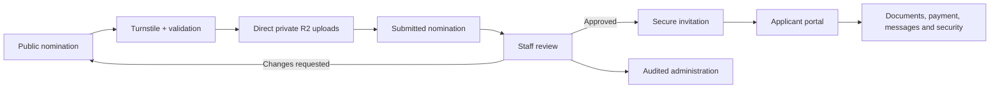

<p align="center">
  <a href="https://access.gbeaward.com">
    
  </a>
</p>

<p align="center">
  <strong>Secure nominations, applicant access and award operations for the Global Business Excellence Awards 2026.</strong>
</p>

<p align="center">
  <a href="https://access.gbeaward.com">🌐 Live portal</a>
  &nbsp;·&nbsp;
  <a href="https://access.gbeaward.com/apply">🏆 Submit a nomination</a>
  &nbsp;·&nbsp;
  <a href="https://access.gbeaward.com/help">💬 Get help</a>
</p>

<p align="center">
  
</p>

# GBE Awards Portal

The production portal for the **Global Business Excellence Awards 2026**. It gives nominees a clear, secure path from public nomination through payment proof and document upload; gives approved applicants a private self-service portal; and gives staff one focused workspace for review, communications, payments, reporting and audit history.

**Live:** [access.gbeaward.com](https://access.gbeaward.com)

**Support:** [info@gbeaward.com](mailto:info@gbeaward.com) · [WhatsApp](https://wa.link/10p065)

**Official site:** [gbeaward.com](https://gbeaward.com)

> [!IMPORTANT]
> This is a production system for personal, nomination and payment information. Never commit `.env`, provider credentials, database exports, real nomination data or screenshots containing private information.

## ✨ What it does

| For                     | Experience                                                                                                                                                                                                                                                         |
| ----------------------- | ------------------------------------------------------------------------------------------------------------------------------------------------------------------------------------------------------------------------------------------------------------------ |
| **Nominees**            | A four-step public nomination journey with category selection, supporting documents, payment choice and payment-proof upload. Every file is uploaded directly to private storage and every completed nomination gets a non-sequential `GBE-2026-######` reference. |
| **Approved applicants** | Invitation-only access to applications, requested documents, payment status, messages, profile, password management and account security. A public nomination never creates an account by itself.                                                                  |
| **Award staff**         | One focused Staff workspace for applications, applicants, payments, files, communications and exports. Payment verification uses a focused review dialog for required reconciliation details; payer and bank-reference context remain optional. Super admins also manage award cycles, categories, staff, settings and audit activity. Staff must enrol TOTP MFA before administration access. |
| **Operations**          | Controlled workflow transitions, reviewer assignment, change requests, payment verification, signed downloads, exports, delivery tracking, retention work and an auditable history of sensitive actions. Server-action buttons lock and show progress while processing, and internal navigation provides delayed feedback without flashing on fast routes. |

## 🧭 Product flow


```mermaid
flowchart LR
  N[Public nomination] --> T[Turnstile + validation]
  T --> U[Direct private R2 uploads]
  U --> Q[Submitted nomination]
  Q --> R[Staff review]
  R -->|Approved| I[Secure invitation]
  R -->|Changes requested| N
  I --> P[Applicant portal]
  P --> O[Documents, payment, messages and security]
  R --> A[Audited administration]
```

The public form is deliberately short and guided:

1. **Nominee** — company name or full name.
2. **Contact** — contact details, award category, mandatory nomination statement and optional supporting documents.
3. **Payment**: secure Genie card checkout (when enabled), or bank transfer with one payment-proof file. Card payments never require a slip.
4. **Confirm** — declaration review, Turnstile verification and submission.

Supporting documents and payment proof are independently limited to **5 MB per file**. The browser gives upload progress, cancellation and retry feedback; the server repeats validation before accepting a completion request.

Normal dashboards, review queues, applicant views and nomination exports exclude soft-deleted nominations. Submitted totals and summaries also exclude unfinished upload shells and unpaid card checkouts. The explicit **Deleted** application view and its exports retain recovery access; audit and delivery history remain available. Deleting or restoring a nomination refreshes the linked admin and applicant workspaces.

### Bulk application actions

Select nominations in **Applications**, then choose **Update status**, **Assign** or **Message**. Each action opens a focused confirmation dialog; message templates show the exact email copy before sending. Selection applies only to the current page (up to 100 records) and resets when filters or pagination change. Selected exports remain available separately.

The Applications table includes clickable email and phone details. On desktop, wider columns scroll inside the table without widening the page; mobile uses contact-friendly cards. Long nomination text remains available through the existing focused tooltip.

Status updates follow the same permissions and workflow rules as individual nominations. Payment verification is required before confirming an entry; rejection and archive require an internal reason. Outcome emails respect each cycle's results release date. Corrections stay on the individual nomination because they need specific editable fields or document requests.

The server locks and validates the complete selection before making changes. Deleted, unpaid, inaccessible or stale records block the batch rather than silently producing partial updates. A stable request ID and durable audit record make retries safe without duplicate status history or messages. Approval prepares portal access after the status transaction; any account/invitation failure is shown separately with links to the affected nominations. Multiple nominations for one pending applicant share the existing valid invitation. No new environment variables, database migration or scheduled job is needed.

### In-progress nominations

**In-progress**, immediately above **Applications**, shows saved but unsubmitted forms to staff and super admins. Continue saves the completed step and uploads its selected attachments directly to private R2 storage. No email, account, official reference or receipt is created by saving a draft. Search by name, phone, email, category or nomination; phone search ignores spaces and punctuation and accepts local numbers or partial digits. Open a record for its saved details and protected attachment previews.

Both nomination lists use desktop tables and readable cards on phones and tablets. In-progress keeps the saved step, last update and nomination visible, with full details one click away. Search updates after a short typing pause; Clear resets it, and pagination keeps the active search. Admin lists share pagination with the visible record range, total matching records and current/total pages. Next and Previous show loading feedback and prevent repeated navigation while pending. Deletion always requires confirmation.

The same browser tab can restore saved details and verified attachments after a reload. Only an opaque draft credential is kept in session storage, not personal data. Closing the tab ends browser-side recovery; the saved record remains available to staff. Failed saves keep the current inputs visible for retry, and version checks prevent a stale tab from overwriting newer changes. Final submission atomically completes the saved draft and reuses verified files without a second upload.

Card checkout creates a recovery record and reserves its reference before contacting Genie, but stays in **In-progress** as **Awaiting payment** until payment is verified. Failed, cancelled and unfinished attempts do not enter Applications, dashboard nomination totals or nomination exports. Switching to bank transfer keeps the record in progress until a valid payment proof is submitted. Existing settled and refunded payment history is preserved. Nominee and admin receipt-of-nomination emails are queued only when the card payment completes or bank proof is accepted, using stable outbox keys to prevent duplicate notifications. Pending checkout links open a focused In-progress detail view, without nomination approval actions.

Drafts remain until submitted or explicitly deleted. Staff and super admins with nomination-edit permission can delete drafts and unpaid checkout records, individually or by selecting records on the current page. Selection resets when search, cycle or pagination changes. An in-site confirmation prevents duplicate requests, and bulk results explicitly identify any records that could not be removed. Each record is checked and locked independently; a changed or submitted record is protected without hiding successful deletions. Legacy unfinished upload shells still require a super admin.

Deleted draft payloads are cleared, an audit tombstone is retained, and removed private draft attachments enter the existing retention queue. Unpaid checkouts are soft-deleted only: attempts, references and supporting documents remain available in the explicit Deleted archive. New checkout and proof actions reject a deleted record. Deletion does not cancel an already-open Genie transaction; a later authenticated, matched confirmation automatically restores a checkout removed by this action, settles it once and places it in Applications. Other administrative deletions are not automatically restored. Completed payments and submitted bank proof are protected. No migration, environment variable or new cron is required.

#### Deploying draft saves

1. Create a Neon restore point or branch before schema work. Do not deploy the new code first.
2. Set `DATABASE_URL_DIRECT` only in the migration shell, then run `bun run db:migrate` to apply additive migration `0011_stiff_vermin.sql`. It adds `nomination_drafts` and `nomination_draft_files`; it does not backfill or rewrite nominations or payments.
3. Grant the existing runtime role `SELECT`, `INSERT` and `UPDATE` on both new tables. Existing file, upload-session, payment and audit permissions remain necessary. `bun run providers:verify` checks the new table permissions.
4. Deploy the application. No new environment variables, provider accounts, Redis or cron schedules are needed. Never add `DATABASE_URL_DIRECT` to the Vercel runtime.

Rollback: restore the previous code deployment while retaining the additive tables and saved data. Do not drop the tables or reverse existing nomination/payment data to roll back the UI.

### Guest tickets

`/tickets` is a separate, login-free guest booking flow. The first page shows event information, availability and a quantity selector. **Continue** opens `/tickets/checkout` for a name, email, contact number and optional business name, then proceeds directly to Genie's hosted card checkout. Tickets never create nominations, applicant accounts or nomination receipts.

Under **Operations > Tickets** (`/admin/tickets`):

- A super admin sets the event name, Colombo date/time, venue, ticket price, total capacity and per-booking limit. Sales start as Draft. Choose **Open for bookings** only when ready to launch. Only one cycle can sell publicly at a time.
- Increase **Total capacity** to release more seats. Existing bookings retain their price. Capacity cannot fall below issued tickets plus active reservations. Event details lock after reservations or issued tickets exist; price and capacity remain editable.
- Staff can search bookings by name, email, phone, booking reference or ticket code, inspect payment state, download tickets and resend the ticket email. Sales can be paused or closed without cancelling existing bookings.
- **Complimentary tickets** require an existing, non-deleted submitted application from the selected cycle. Contact details come from that application, not arbitrary manual recipients. Issuance requires an internal note and respects capacity. Unused complimentary bookings can be cancelled; checked-in ones cannot.
- Paid bookings can be linked from their detail page to a submitted application in the same cycle. The link covers the whole booking, not individual tickets; several bookings can link to the same application. Staff can change or remove a paid booking's link without altering its contact details, price, QR codes or admission history. Complimentary bookings keep their original application. Changes are audited and reject stale edits.
- Each guest has an independent random QR ticket in the attached PDF, with the booking name, email and business name (when provided) printed above its privacy footer. Contact details are not embedded in the QR itself.
- **Event check-in** (`/admin/tickets/scan`) is restricted to staff and super admins with `payments.verify`. Start the camera or scan a screenshot locally, review the guest and linked application, then **Confirm check-in**. The result includes contact details, booking reference and paid/complimentary type. Linked nominee, category and nomination details appear only with application permission; long nominations expand on any screen size. **Scan next** resumes the camera. Already-used and invalid tickets are clearly flagged. Simultaneous check-ins cannot admit the same ticket twice. Camera access is allowed only on this route and requires HTTPS (localhost also works); denied camera access has a screenshot fallback. No image is uploaded or stored.
- A phone's own camera can also open `/admin/tickets/check-in/[id]`. Staff sign-in and MFA are required, with a strictly allowlisted return path through login. A scan alone never changes state. Refunds/reversals invalidate tickets. Do not admit a guest while a network error leaves confirmation uncertain; rescan to check the saved admission state.

#### Payment and reservation safeguards

The details step has a server-signed five-minute window and a compact red countdown. Refreshing availability keeps entered details while loading the current price; merely viewing the form does not reserve stock. Pressing Pay creates a five-minute reservation, then Genie receives a separate fixed 15-minute checkout expiry. Retries never extend either saved deadline. The private payment page shows its countdown and checks the gateway once at expiry. Unstarted expired reservations release automatically in availability calculations. An uncertain or active gateway payment continues reserving capacity until an authenticated Genie response resolves it; never free seats merely because a local timer or network request timed out. Signed gateway callbacks and the existing daily job reconcile abandoned payments. Buyers can check payment on their private booking page; staff can supply a missing Genie transaction ID from the merchant dashboard for verified recovery.

Only a fetched `CONFIRMED` transaction with the matching app, local payment ID, currency and amount issues tickets. Duplicate clicks, webhooks and issuance retries do not generate extra tickets or initial emails. A late successful payment that exceeds capacity becomes **Needs review**, without overselling: increase capacity and check payment again, or refund in Genie. Paid bookings are not manually marked refunded. Use the merchant dashboard, then **Check payment** to synchronize the reversal.

Ticket mail uses the durable outbox with a PDF attachment and a private booking link. Resend fetches that attachment from a stable, separately signed private download URL, keeping retry payloads identical. The URL must be reachable by Resend over HTTPS after deployment. Resends retain the same ticket codes. Delivery failures remain visible under the booking and in Communications. No PDF bytes are stored in the database or R2; bounded ticket PDFs are generated on demand. Keep `BETTER_AUTH_SECRET` stable because it signs email access links and attachment URLs. QR admission IDs remain random database identifiers.

#### Deploying guest tickets

1. Create a Neon restore point or backup branch. Review and apply additive migrations `0014_new_mother_askani.sql` and `0015_naive_taskmaster.sql` with `bun run db:migrate` and the local migration-owner URL. They create new tables and do not change existing nomination data.
2. Grant the existing least-privilege runtime role `SELECT`, `INSERT`, and `UPDATE` on `public.ticket_sales`, `public.ticket_bookings`, `public.ticket_payment_attempts`, and `public.guest_tickets`. Existing audit and email-outbox permissions are also required. `bun run providers:verify` checks the new tables and privileges.
3. No new environment variables are required. The feature reuses `GENIE_ENABLED`, `GENIE_ENVIRONMENT`, `GENIE_APP_ID`, `GENIE_API_KEY`, `GENIE_WEBHOOK_BASE_URL` (if configured), the public app URL, Turnstile, Resend and `BETTER_AUTH_SECRET`. The new signed callback is `/api/webhooks/genie-tickets`, supplied on each ticket transaction. Use Turnstile action `gbe_ticket_booking` with the existing allowed hostname.
4. Deploy with sales closed, verify the new routes, then test a controlled Genie UAT payment and ticket email before launching. The daily dispatcher handles bounded reconciliation; there is no new cron schedule or Redis dependency.

For rollback, close sales first, retain booking/payment/ticket records and restore the previous application build only when no ticket checkout is active. Do not drop ticket tables or erase payment evidence. Production migrations and release remain explicit owner actions.

## 🏗️ Architecture

| Layer            | Technology                                             | Responsibility                                                                                            |
| ---------------- | ------------------------------------------------------ | --------------------------------------------------------------------------------------------------------- |
| Application      | Next.js 16 App Router, React 19, strict TypeScript     | Public, applicant and staff routes; server actions; route handlers; streaming loading states.             |
| Interface        | Tailwind CSS 4, shadcn/Base UI, TanStack Table         | Responsive, keyboard-accessible light-mode interface with tailored mobile/tablet layouts.                 |
| Data             | Neon PostgreSQL, Drizzle ORM                           | Relational award data, workflow state, accounts, audit history, email outbox, rate limits and migrations. |
| Authentication   | Better Auth + Drizzle adapter                          | Approval-first invitations, password recovery, session revocation and mandatory TOTP MFA for staff.       |
| File storage     | Cloudflare R2 + AWS SDK                                | Private, browser-to-R2 presigned uploads; type detection; signed downloads; lifecycle cleanup.            |
| Abuse protection | Cloudflare Turnstile + PostgreSQL-backed rate limiting | Nomination verification plus an adaptive login challenge after two failed attempts; durable across instances. |
| Email            | Resend + React Email                                   | Durable outbox, idempotent delivery, retry/backoff and signed delivery webhooks.                          |
| Exports          | ExcelJS, CSV and React PDF                             | Filtered staff exports and private applicant application summaries.                                       |
| Hosting          | Vercel + Cloudflare DNS                                | Production hosting, security headers and one Hobby-compatible daily cron.                                 |

### Security model

- **Public routes** are limited to the nomination and information pages. Turnstile checks action and expected hostname server-side. Login challenges appear only after two failed attempts for the same hashed email/IP fingerprint and are verified before a further password check.
- **Private routes** are protected early by `src/proxy.ts`, then enforce a session and application-level profile checks in the server data-access layer.
- **Staff routes** require a staff profile, active membership and mandatory TOTP MFA. Staff can complete the full nomination workflow; super admins additionally manage people and system configuration. The QR code and manual setup URI work with Google Authenticator, Microsoft Authenticator and compatible apps.
- **Uploads** go to the private R2 bucket by presigned URL. Object metadata, detected types, ownership and disposition are checked before a record becomes available. Authorized PDF/image previews are fetched only when their dialog opens and streamed through the protected route. PDF.js is lazy-loaded to render PDF pages consistently without relying on a browser plug-in; image object URLs are temporary and revoked on close. Downloads remain short-lived signed R2 responses.
- **Programme media** on `/apply` is an on-demand dialog: the Facebook post/reel frames and their client bundle load only after a visitor requests them. The adjacent event-brochure action is a verified direct Google Drive download. No Facebook SDK is loaded into the nomination page; the restrictive policy permits Facebook only as a frame source for this dialog.
- **Recognition strip** on `/apply` uses locally versioned LBC, DEC and SITC artwork with the relevant UK and Sri Lankan flags. The below-form strip is server-rendered, CSS-only, pauses on interaction and becomes a manually scrollable row when reduced motion is preferred.
- **Sensitive operations** write audit events. A super admin may remove only an empty, unfinished nomination shell; the operation refuses submitted nominations or retained evidence, removes staged private uploads and mutable operational records, then soft-deletes the shell. Its immutable audit trail is retained. Administrative data is noindexed, and platform headers block framing and apply a restrictive content policy.
- **Database roles are split:** the runtime uses the least-privilege pooled connection; migrations use a separate direct owner connection.

## 🗺️ Repository map

```text
src/
├── app/                 # App Router pages, layouts, loading/error boundaries and API routes
│   ├── apply/           # Public guided nomination and submitted confirmation
│   ├── portal/          # Private applicant portal
│   ├── admin/           # Permission-aware staff workspace
│   ├── auth/            # Invite acceptance, password recovery and staff MFA
│   └── api/             # Uploads, exports, health, cron and Resend webhook handlers
├── components/          # Reusable interface, forms, uploads, admin and shared shell components
├── config/              # Brand, navigation and role-permission definitions
├── emails/              # React Email presentation components and templates
├── lib/                 # Environment parsing, Better Auth, Drizzle, R2 and domain helpers
└── server/              # DAL, actions, jobs, security and business services

drizzle/migrations/      # Append-only PostgreSQL migrations
scripts/                 # Environment, provider, seed and first-admin commands
tests/                   # Unit, integration and Playwright end-to-end tests
public/brand/            # Versioned logo and award artwork used by the application and this README
```

## 🚀 Run locally

### Prerequisites

- [Bun](https://bun.sh/) **1.3.12** (the version pinned in `package.json`)
- A non-production Neon/PostgreSQL database with two distinct roles: runtime and migration owner
- Two non-production Cloudflare R2 buckets (private uploads and public assets), with browser PUT CORS configured for the local origin
- Cloudflare Turnstile test keys for local work
- A non-production Resend API key and verified sending domain when email flows are being exercised

### First run

```bash
bun install
cp .env.example .env
bun run env:verify
bun run db:migrate
bun run dev
```

Open [http://localhost:3000](http://localhost:3000). The public nomination route is `/apply`.

> [!TIP]
> The local defaults are intentionally safe for UI work. Full provider operations require the non-production values described in [Environment configuration](#-environment-configuration).

### Seed an award cycle

The seed command creates the approved 2026 categories but deliberately leaves the cycle in **draft**. It cannot silently open public nominations.

```bash
SEED_CYCLE_OPENS_AT=2026-01-01T00:00:00.000Z \
SEED_CYCLE_CLOSES_AT=2026-12-31T23:59:59.999Z \
bun run db:seed
```

Review the dates, legal copy, categories, fees, payment instructions and feature flags in administration before an authorized super administrator changes the cycle status.

### Bootstrap the first staff account

This command is one-time only. It refuses to run once a super administrator exists.

After securely setting all three `BOOTSTRAP_ADMIN_*` variables in the local environment, run:

```bash
bun run db:bootstrap-admin
```

Sign in, enrol TOTP MFA immediately, then remove all three `BOOTSTRAP_ADMIN_*` values from the environment. Create every later staff account from **Administration → Staff**.

## 🔐 Environment configuration

Copy [.env.example](.env.example); it is the complete, non-secret contract. Keep actual values in local environment files or encrypted Vercel settings only.

| Group          | Variables                                                                                                                                                           | Notes                                                                                                                           |
| -------------- | ------------------------------------------------------------------------------------------------------------------------------------------------------------------- | ------------------------------------------------------------------------------------------------------------------------------- |
| Application    | `NEXT_PUBLIC_APP_URL`, `APP_ENV`, `APP_TIMEZONE`, `SUPPORT_EMAIL`, `OFFICIAL_SITE_URL`                                                                              | Production URLs must use HTTPS. The portal timezone is `Asia/Colombo`.                                                          |
| Database       | `DATABASE_URL`, `DATABASE_URL_DIRECT`                                                                                                                               | Required. Use separate runtime and migration-owner roles; never use the direct owner URL in the Vercel runtime.                 |
| Authentication | `BETTER_AUTH_SECRET`, `BETTER_AUTH_URL`                                                                                                                             | Required. The URL must exactly match `NEXT_PUBLIC_APP_URL`; the secret must be at least 32 characters.                          |
| R2             | `R2_ACCOUNT_ID`, `R2_ACCESS_KEY_ID`, `R2_SECRET_ACCESS_KEY`, `R2_ENDPOINT`, `R2_PRIVATE_BUCKET`, `R2_PUBLIC_BUCKET`, `R2_OBJECT_PREFIX`, `R2_PUBLIC_ASSET_BASE_URL` | Keep uploads/exports in the private bucket. Use `R2_OBJECT_PREFIX` to isolate preview, test and production objects.             |
| Turnstile      | `NEXT_PUBLIC_TURNSTILE_SITE_KEY`, `TURNSTILE_SECRET_KEY`, `TURNSTILE_EXPECTED_HOSTNAME`, `TURNSTILE_APPLICATION_ACTION`                                             | Use Cloudflare’s test keys only outside production. The portal verifies `gbe_nomination_submit` for nominations and `gbe_login` after two failed sign-ins. |
| Resend         | `RESEND_API_KEY`, `RESEND_WEBHOOK_SECRET`, `EMAIL_FROM`, `EMAIL_REPLY_TO`                                                                                           | `EMAIL_FROM` must use a verified Resend domain. Configure the signed Resend webhook at `/api/webhooks/resend`.                  |
| Genie Business | `GENIE_ENABLED`, `GENIE_ENVIRONMENT`, `GENIE_API_KEY`, `GENIE_APP_ID`, `GENIE_WEBHOOK_BASE_URL` | Disabled by default. Use `sandbox` with UAT credentials, and `production` with the live app credentials. The optional webhook origin defaults to the public app URL. All credentials stay server-side. |
| Operations     | `CRON_SECRET`                                                                                                                                                       | Required and at least 24 characters. Authorizes maintenance routes; Vercel invokes only `/api/cron/daily` on the scheduled job. |
| First admin    | `BOOTSTRAP_ADMIN_NAME`, `BOOTSTRAP_ADMIN_EMAIL`, `BOOTSTRAP_ADMIN_PASSWORD`                                                                                         | Temporary only. Remove immediately after the initial account has been created and secured.                                      |
| Seed           | `SEED_CYCLE_OPENS_AT`, `SEED_CYCLE_CLOSES_AT`                                                                                                                       | Required only by `bun run db:seed`; use approved ISO 8601 timestamps.                                                           |

Run both checks after configuring an environment:

```bash
bun run env:verify
bun run providers:verify
```

`env:verify` rejects unsafe configuration such as matching runtime/owner database URLs, production Turnstile test keys or leftover bootstrap credentials. `providers:verify` proves database access, runtime rate-limit permissions, private R2 read/write/delete plus browser CORS, Resend sender status and Turnstile hostname policy.

## 💳 Genie Business card payments

Card checkout uses Genie Business hosted payment pages, not an embedded card form. The portal never receives card numbers or CVVs. New nominations snapshot the cycle fee; existing payment amounts and evidence are unchanged. A saved card nomination gets a secure, HTTP-only payment session for seven days, without creating an account. Invited applicants can also resume their own eligible payment from `/portal/payment`.

Card checkout and bank transfer use the nomination's saved fee. The 2026 LKR schedule below applies to new submissions. The owner-confirmed LKR 10 live test is complete and the temporary override is disabled (`CARD_TEST_AMOUNT_MINOR = null` in `src/lib/domain/card-checkout-amount.ts`). Existing active checkouts retain their original amount, and receipts record the amount actually paid. Do not rewrite previous test payments or receipts. No additional environment variable is required for normal pricing.

### Special invites

**Special invites** in `/admin/special-invites` follows the selected award cycle. Super admins issue a batch by entering a discount and quantity (1 to 100). Staff can track claims and open the linked draft or nomination. A batch generates cryptographically random six-character uppercase letter/number codes, with a database uniqueness constraint and collision retries. Generating the same request again cannot create a duplicate batch.

Generation downloads a ZIP of individual **Code 128 JPGs**, each with its readable code below the barcode. Unused invites also have individual JPG downloads and can be cancelled with confirmation. Download endpoints recheck that codes are unused. Claimed, expired, cancelled and used codes cannot be downloaded again. Previously downloaded copies cannot be recalled, but a code still only works once.

The production build explicitly includes Sharp's native image libraries for invite downloads and profile-image processing. `bun run build` checks JPG generation using only the invite route's traced deployment dependencies, not the full local installation. Rerun that check after a build with `bun run build:verify-invite-download`. A failed download does not cancel or consume an invite; retry the existing batch or individual JPG after resolving the error.

On **3. Payment**, **Claim Special Invite** accepts typed codes or a JPG, PNG or WebP barcode image up to 5 MB. Image decoding is loaded on demand and happens entirely in the browser; the image is not uploaded or stored. Codes are case-insensitive. Claims require the existing, Turnstile-verified draft credential, same-origin checks and durable per-IP/per-draft rate limits.

- Claiming subtracts the invite discount from the current fee and locks that price to the draft for exactly one hour. The discount must leave a positive payable amount; invites do not create free nominations.
- One invite can be claimed per draft. Retrying the same claim is safe and never extends its timer. Codes cannot transfer to another draft or be reused after expiry.
- A red countdown and crossed-out original fee appear during the claim. This replaces the general offer banner while the invite is active, so applicants see only their applicable deadline. The browser restores the claim after a reload in the same tab and updates on expiry without polling or a cron.
- Card and bank-transfer choices remain available. Final submission, not payment verification, consumes the invite in the same transaction as the nomination. A submitted card nomination can finish its hosted checkout later at the saved amount. Bank transfers still require proof.
- Expiry before submission restores the current fee and requires a new price acknowledgement without removing details or files. A claimed price survives later general-offer changes. Deleting its draft cancels the claim permanently; no code is returned to the unused pool. Existing nominations and payment attempts are never repriced.

#### Deploying special invites

1. Create a Neon restore point or backup branch. Apply reviewed additive migrations `0012_groovy_jetstream.sql` and `0013_woozy_scarecrow.sql` with `bun run db:migrate`, using the local owner connection `DATABASE_URL_DIRECT`. They add invite tables and integrity checks only; they do not update historical nomination/payment data.
2. Grant the existing runtime role `SELECT, INSERT` on `public.special_invite_batches` and `SELECT, INSERT, UPDATE` on `public.special_invites`. No delete permission is needed. `bun run providers:verify` checks these permissions.
3. Deploy the application only after the migration and grants. **No new environment variables, Redis service, storage bucket or scheduler are required.** Keep the current `BETTER_AUTH_SECRET` stable: invite codes are encrypted at rest with a domain-specific key derived from it. Rotating this secret requires decrypting/re-encrypting outstanding codes under controlled maintenance before switching the key.
4. Check issuing, ZIP/JPG download, claim, expiry and submission on an isolated test cycle/database first. Do not create test codes or nominations in production without explicit approval.

Rollback: keep these additive tables and roll application code back to the previous release if necessary. Do not drop invite records or rewrite discounted payment snapshots. Outstanding invites cannot be claimed on the previous release; preserve their records for recovery.

### Nomination offers

Super admins manage offers in **Award cycles > Edit offer** (`/admin/cycles`). The compact editor controls the banner wording, Colombo start/end times, offer fee and regular fee. Amounts are entered in the cycle's currency, not minor units. Saves validate the dates and discount, require configuration permission, retain an audit record and reject conflicting edits from another window. Turning an offer off applies the regular fee immediately and removes its banner.

Each cycle's configuration is stored in the existing `system_settings` table under `nomination_offer:<cycle ID>`. No migration, environment variable or additional scheduler is needed. Before the start, the cycle base fee applies; during the offer, the offer fee applies; at and after the end, the regular fee applies. Do not change a cycle's currency while it has an offer. A malformed saved configuration blocks pricing rather than silently charging a fallback amount.

Until an admin saves a replacement, the owner-approved 2026 LKR schedule in `src/lib/domain/nomination-pricing.ts` remains the default. Its fixed Asia/Colombo timestamps do not restart on deployment:

| Period | New nomination fee |
| --- | --- |
| Before 16 September 2026, 12:00 PM | Configured cycle base fee |
| 16 September 2026, 12:00 PM to 17 September 2026, 12:00 PM (exclusive) | LKR 65,000 |
| From 17 September 2026, 12:00 PM | LKR 85,000 |

The red countdown appears only during the configured window on `/apply`. At expiry, it disappears along with the crossed-out price and offer label. An open form updates its fee at schedule boundaries without a reload. Admin edits are picked up on page load, step saves and submission; an applicant must review a changed fee before proceeding. Countdown ticks are local and isolated from the form, with no database polling or additional cron. The loading boundary uses the same configuration as the page.

Both public initiation paths and final submission use `src/server/services/nomination-offers.ts` to enforce the server-time price. Final submission locks the cycle while reading the latest settings so a concurrent offer edit cannot change the accepted fee midway through finalization. A stale or missing price acknowledgement returns `409 PRICE_CHANGED` with the current fee; saved details and uploads remain available. Bank-transfer nominations and proof must reach final submission before the deadline for the offer price. Drafts and incomplete upload sessions do not reserve the general offer fee unless a special invite has locked a price for its one-hour claim window. Submitted nominations, active card attempts, receipts and historical amounts are unchanged. Other cycles use their base fee until an offer is configured.

Deploy before an offer begins to show its full window. A deployment during an offer shows only the remaining time. The initial 2026 default starts automatically without a database write; later changes are made through the admin editor after deploying this feature. The cycle's stored base fee and existing payment records are never rewritten by an offer save.

Internal `RCT-` references remain in payment records and staff views, but are not displayed on public or applicant payment-confirmation screens. Nomination references and payment status remain visible.

- Only an authenticated Genie transaction lookup with matching transaction ID, local reference, App ID, currency and amount can verify payment. Browser redirects and webhook payloads cannot mark a payment as paid.
- `/api/webhooks/genie` verifies Genie's SHA-256 signature headers and then fetches the authoritative transaction. `CONFIRMED` settles the payment once and allocates one receipt. `AUTHORIZED` is not a completed payment.
- One active checkout is allowed per payment. Repeated clicks resume it. An uncertain timeout keeps the attempt pending rather than risking a second charge. Staff can use **Check Genie status** in the nomination's payment section and recover a missing transaction ID using the attempt reference shown there.
- Applicants can switch methods while no checkout is active. After starting checkout, wait for provider-confirmed cancellation or expiry (the checkout window is 15 minutes), then check status before selecting bank transfer. This prevents a second payment while a card payment may still succeed. Bank proof enters the normal staff-review workflow; it is not automatically verified.
- Return-page status checks are bounded (eight automatic checks, then a manual button). The existing daily job checks at most five older active attempts. No extra cron or Redis service is required.
- Full `REFUNDED`/`VOIDED` states on the settled transaction are recorded when reconciled. Refunds are initiated in Genie, not this portal. Partial refunds represented as separate Genie child transactions require staff reconciliation in Genie.

Before enabling this on Vercel:

1. Take a Neon restore point or branch, then run the reviewed additive migration with `bun run db:migrate` using `DATABASE_URL_DIRECT` locally. Include migration `0010_known_paladin.sql`, its generated snapshot and journal entry in the release. Do not seed or backfill existing nominations.
2. Confirm the runtime database role has `SELECT`, `INSERT` and `UPDATE` on `public.payment_attempts`. Existing permissions on applications, payments, receipt sequences and audit records remain necessary. `bun run providers:verify` checks the new table when Genie is enabled.
3. In the production Vercel environment set `GENIE_ENABLED=true`, `GENIE_ENVIRONMENT=production`, `GENIE_APP_ID` and `GENIE_API_KEY` from the **GBE Awards Portal** app in the Genie dashboard. Never put these keys in `NEXT_PUBLIC_*`. Keep `NEXT_PUBLIC_APP_URL` and `BETTER_AUTH_URL` at `https://access.gbeaward.com`. Leave `GENIE_WEBHOOK_BASE_URL` unset unless using a separate public callback origin.
4. Deploy only after migration and configuration. The create-transaction request supplies `https://access.gbeaward.com/api/webhooks/genie` for each checkout; no additional scheduler is needed. Verify a controlled production transaction and its receipt after the owner approves going live.

For isolated local UAT, PostgreSQL must be running on `127.0.0.1:5432` with local-user access. Run `bun scripts/dev-genie.mjs /path/to/the-provided-test-api-keys.txt`. This helper migrates only `gbe_award_portal_test_genie`, uses the `e2e/genie` storage prefix, disables email and starts port 3101. It does not modify `.env`. Set `GENIE_LOCAL_PUBLIC_URL` to your temporary HTTPS tunnel origin before starting the helper to test Genie return URLs and callbacks. The exact tunnel hostname is allowed only in Next.js development. R2 CORS must allow that origin to exercise bank uploads through the tunnel; do not broaden production CORS to a wildcard. Never use live cards or production keys in this helper.

## 🧪 Quality checks

| Command                    | What it proves                                                                                                                                                                                                                             |
| -------------------------- | ------------------------------------------------------------------------------------------------------------------------------------------------------------------------------------------------------------------------------------------ |
| `bun run lint`             | ESLint passes with zero warnings.                                                                                                                                                                                                          |
| `bun run typecheck`        | Strict TypeScript has no errors.                                                                                                                                                                                                           |
| `bun run test`             | Fast unit tests for business rules, security/permissions, validation, loading boundaries, exports and PDFs.                                                                                                                                |
| `bun run test:integration` | Database-integrity tests against an isolated `gbe_award_portal_test*` database. Requires `TEST_DATABASE_URL` and `TEST_DATABASE_ADMIN_URL`.                                                                                                |
| `bun run test:e2e`         | Playwright desktop/mobile journeys using a recreated `gbe_award_portal_test_e2e` database and `e2e/playwright` R2 prefix. It covers public submission, retries, file validation, adaptive login protection, accessibility, staff MFA, export and responsive overflow. |
| `bun run build`            | Production Next.js build.                                                                                                                                                                                                                  |
| `bun run check`            | Lint, typecheck, unit tests and production build in one command.                                                                                                                                                                           |
| `bun audit`                | Bun dependency vulnerability audit.                                                                                                                                                                                                        |

> [!CAUTION]
> Integration and end-to-end tests recreate dedicated test databases. Their names are guarded in code, but they still require a database owner connection that is allowed to create and drop only test databases. Never point test variables at a production database.

## 🗃️ Database and file operations

Migrations in `drizzle/migrations` are append-only and are the source of truth for schema history.

```bash
bun run db:generate  # generate a migration, then review it carefully
bun run db:migrate   # apply reviewed migrations with DATABASE_URL_DIRECT
bun run db:studio    # local inspection only
```

Do not run `db:push` against staging or production. Before any production schema change, take a Neon branch or restore point, confirm the migration is backward-compatible with the currently deployed application, apply it with the owner URL, and retain a rollback path.

Files are not stored in PostgreSQL or Vercel’s filesystem. The application stores file records and audit metadata in PostgreSQL, while original bytes live in R2. Private downloads are signed per request and exports are temporary private objects.

## 📬 Email, webhooks and maintenance

Application responses queue email in PostgreSQL. A Next.js `after()` callback attempts prompt delivery; a durable outbox retries failed messages with backoff, and Resend’s signed webhook records delivered, bounced and failed events.

| Endpoint                    | Purpose                                                                                                  | Protection                                                   |
| --------------------------- | -------------------------------------------------------------------------------------------------------- | ------------------------------------------------------------ |
| `POST /api/webhooks/resend` | Records verified Resend delivery events                                                                  | `RESEND_WEBHOOK_SECRET` signature verification               |
| `GET /api/cron/daily`       | Runs email retries, stale-upload expiry, expired-export cleanup, retention and stale rate-limit cleanup; unfinished nominations remain available | Bearer authorization using the configured `CRON_SECRET`      |
| `GET /api/health`           | Reports database reachability                                                                            | No secrets returned; do not treat it as a public status page |

Vercel Hobby supports one cron entry. [vercel.json](vercel.json) schedules the daily route at `23 2 * * *`; do not add overlapping Vercel cron entries for individual cleanup jobs.

## 🚢 Production release checklist

1. **Review scope** — inspect the diff, check that no secrets or production data are included, and preserve approved award copy unless the change explicitly calls for it.
2. **Validate locally** — run `bun run check`, then the relevant integration/E2E suite. Run `bun run env:verify` and `bun run providers:verify` with the target environment.
3. **Prepare data safely** — take a Neon restore point/branch; apply only reviewed backward-compatible migrations with `DATABASE_URL_DIRECT`.
4. **Deploy** — push `main`; Vercel deploys production. Wait for `Ready` and verify the `access.gbeaward.com` alias.
5. **Prove critical paths** — confirm `/api/health`, one sign-in/MFA path, one authorized private upload/download, the current award-cycle settings, cron authorization and Resend delivery-webhook events.
6. **Observe** — use Administration → Communications and Activity to inspect delivery, workflow and operational events after release.

The deployment process never opens a cycle automatically. Opening, closing or changing award programme settings remains an explicit, authorized administrative decision.

## 🤝 Contributing and maintenance

This repository is maintained as a production application. Before changing it, read [AGENTS.md](AGENTS.md) for the exact project workflow, architecture boundaries, security requirements and verification expectations.

In short: use Bun, keep server/data access on the server, preserve the private-file and permission model, add migrations rather than rewriting history, test the affected route at desktop and mobile widths, and do not make external provider, deployment or award-programme changes without explicit authorization.

## 📄 Public information

- [Privacy policy](https://gbeaward.com/privacy-policy)
- [Portal terms](https://access.gbeaward.com/terms)
- [Portal help](https://access.gbeaward.com/help)
- [Official GBE Awards website](https://gbeaward.com)
- [Proprietary licence](LICENSE)
